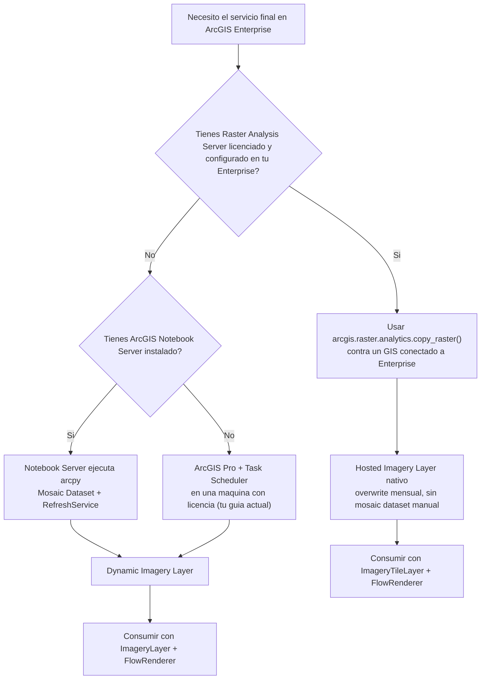
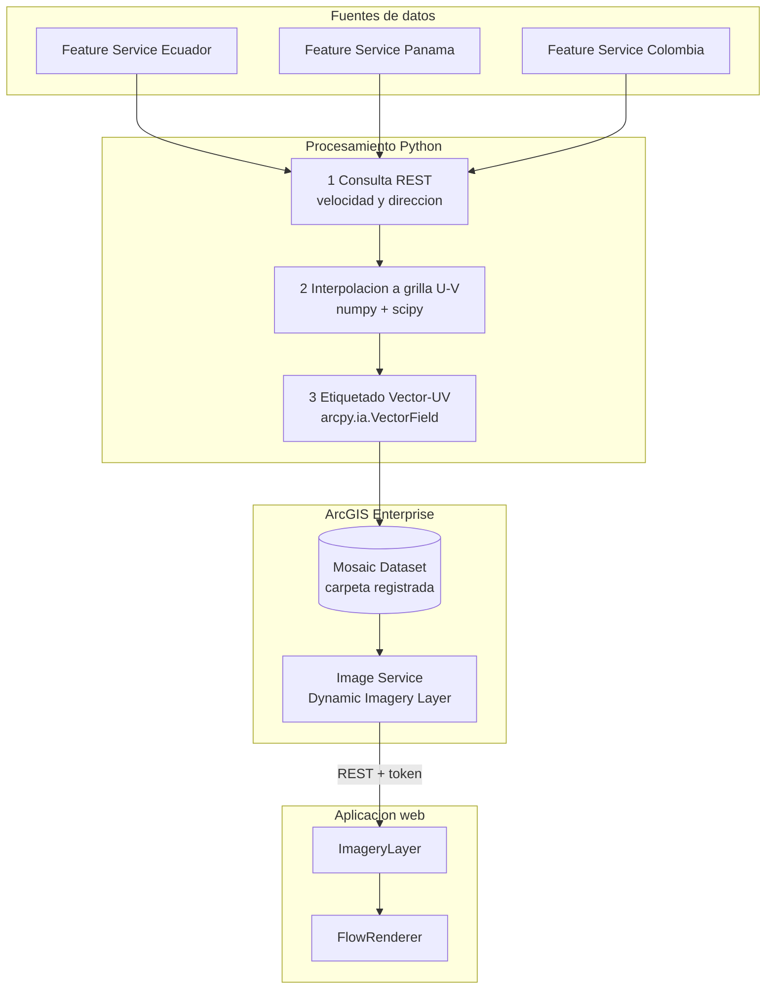
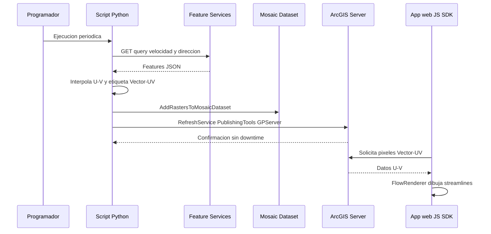

# Visor de comportamiento de vientos con ArcGIS (FlowRenderer)

> Guía de arquitectura para construir un visor tipo **VientosColombia**
> (`geoapps.esri.co/VientosColombia`) — streamlines animados de viento —
> usando ArcGIS Maps SDK for JavaScript, resolviendo dónde debe vivir el
> procesamiento y dónde debe vivir el servicio final.
>
> Corrige y amplía `guia-raster-viento-enterprise-pro.md` con hallazgos
> verificados contra documentación oficial de Esri (developers.arcgis.com,
> enterprise.arcgis.com, pro.arcgis.com, esri.com/arcgis-blog). Septiembre 2026.

## Índice

1. [Objetivo](#1-objetivo)
2. [Respuesta directa: ¿generar en AGOL, alojar en Enterprise?](#2-respuesta-directa-generar-en-agol-alojar-en-enterprise)
3. [Conceptos que hay que tener claros antes de decidir](#3-conceptos-que-hay-que-tener-claros-antes-de-decidir)
4. [Arquitecturas posibles — comparativa](#4-arquitecturas-posibles--comparativa)
5. [Arquitectura recomendada](#5-arquitectura-recomendada)
6. [Correcciones sobre la guía Enterprise previa](#6-correcciones-sobre-la-guía-enterprise-previa)
7. [Guía paso a paso](#7-guía-paso-a-paso)
8. [Consumo desde ArcGIS Maps SDK for JavaScript](#8-consumo-desde-arcgis-maps-sdk-for-javascript)
9. [Cómo obtener un verdadero Tiled Imagery Layer en Enterprise](#9-cómo-obtener-un-verdadero-tiled-imagery-layer-en-enterprise)
10. [CORS, autenticación y exposición pública](#10-cors-autenticación-y-exposición-pública)
11. [Checklist de prerrequisitos y licenciamiento](#11-checklist-de-prerrequisitos-y-licenciamiento)
12. [Limitaciones](#12-limitaciones)
13. [Errores comunes y diagnóstico](#13-errores-comunes-y-diagnóstico)
14. [Referencias oficiales](#14-referencias-oficiales)

---

## 1. Objetivo

- Replicar el comportamiento visual del visor de referencia: streamlines
  animados de viento con controles de densidad, velocidad, longitud de
  trazas y representación (hacia / desde).
- Resolver la duda arquitectónica de fondo: **¿se puede generar el
  procesamiento en ArcGIS Online pero dejar el servicio final alojado en
  ArcGIS Enterprise?**
- Dejar el resultado consumible como capa de imagen desde una página web
  con ArcGIS Maps SDK for JavaScript (`ImageryLayer` / `ImageryTileLayer`
  + `FlowRenderer`).

El visor de referencia expone estos controles (confirmado inspeccionando la
página): ancho de trayectoria, longitud de trayectoria, densidad, velocidad
del viento, longitud máxima del camino, representación (hacia/desde) y
efectos habilitados. Todos corresponden 1:1 a propiedades reales de
`FlowRenderer` (`trailWidth`, `trailLength`, `density`, `flowSpeed`,
`maxPathLength`, `flowRepresentation`, `effect`) — no es una capa custom,
es `FlowRenderer` con su panel de propiedades expuesto en la UI.

---

## 2. Respuesta directa: ¿generar en AGOL, alojar en Enterprise?

**No existe una ruta oficial de "publicar en AGOL → aparece alojado en
Enterprise" de forma automática.** AGOL y Enterprise son dos despliegues
de Web GIS independientes, cada uno con su propio almacenamiento de
contenido. No hay federación de datos entre ambos por defecto.

La prueba más concluyente está en la propia guía oficial de Esri para
mover contenido entre AGOL y Enterprise (`clone_items()`, la herramienta
recomendada para esto vía ArcGIS API for Python):

> `clone_items()` **no clona map services ni image services**. Como estos
> servicios pueden estar publicados en servidores distintos al servidor de
> hosting, es imposible que la función determine dónde publicarlos en el
> destino. El ítem se copia, pero la capa sigue apuntando a la **URL de
> origen** original.

En otras palabras: si generas el wind service en AGOL y luego "clonas" el
ítem hacia tu Enterprise, obtienes una copia del *item* (metadatos, thumbnail,
descripción) pero la capa de imagen real **sigue viviendo y sirviéndose desde
AGOL**. No hay forma de que el dato "se mude" solo.

### Lo que sí es real y soportado

| Ruta | Cómo funciona | Cuándo tiene sentido |
|---|---|---|
| **A. Publicar directo en Enterprise desde el origen** | El script corre en un entorno con `arcpy` (ArcGIS Pro o ArcGIS Notebook Server) y escribe directo al mosaic dataset / raster store de Enterprise. Es lo que ya hace tu guía subida. | Es la ruta más simple y la que no depende de licenciamiento adicional más allá de Image Server. |
| **B. Raster Analytics nativo de Enterprise** | Si tu Enterprise tiene un **Raster Analysis Server** licenciado (rol de servidor separado del hosting server), puedes usar `arcgis.raster.analytics.copy_raster()` — la misma función que usarías en AGOL — apuntando la conexión `GIS()` a tu portal Enterprise en vez de a AGOL. El job corre en el servidor de análisis raster de Enterprise y el resultado queda como Hosted Imagery Layer nativo ahí. | Cuando quieres el patrón "overwrite" simple de AGOL pero con el dato en tu Enterprise, y tienes (o puedes licenciar) ese rol. |
| **C. AGOL solo como entorno de cómputo** | Un ArcGIS Notebook de AGOL corre la parte que **no** requiere `arcpy` (consulta REST + interpolación numpy/scipy), y el resultado se envía a Enterprise conectando el `GIS()` del script al portal Enterprise (vía B) o dejando el archivo listo para que un proceso dentro de tu red lo tome. | Solo aporta algo si además tienes la ruta B configurada; si no, es más simple correr exactamente el mismo script dentro de Enterprise (ver §5). |
| **D. Migración manual del dato crudo** | Descargas el CRF/GeoTIFF ya generado en AGOL y lo vuelves a publicar en Enterprise a mano. | Migración puntual única, no un pipeline recurrente. |

### La trampa técnica de la ruta "orquestar desde AGOL"

Los **ArcGIS Notebooks de AGOL** traen la ArcGIS API for Python y el stack
científico de Python (numpy, pandas, scipy, etc.), pero **no traen `arcpy`**
— `arcpy` requiere una licencia de escritorio/servidor de Esri que el entorno
de notebooks en la nube de AGOL no tiene. Eso significa que los pasos de tu
guía que dependen de `arcpy` (`CreateMosaicDataset`, `AddRastersToMosaicDataset`,
`CompositeBands_management`, `RefreshService` vía `arcpy.PublishingTools`)
**no pueden ejecutarse dentro de un notebook de AGOL bajo ningún escenario**.

Por eso, si tu Enterprise no tiene Raster Analytics (ruta B), la única forma
de que AGOL "orqueste" hacia Enterprise es que el notebook de AGOL solo
prepare datos (sin arcpy) y algo *dentro de tu red* con `arcpy` tome ese
resultado y lo publique — lo cual añade una dependencia de red (AGOL debe
poder alcanzar ese proceso) sin ahorrarte nada frente a correr el mismo
script completo dentro de Enterprise desde el principio.

**Conclusión práctica:** si el destino final es Enterprise, lo más simple,
robusto y sin dependencias de red externas es que el pipeline corra
*dentro* de Enterprise desde el primer paso (Notebook Server o Pro), no que
se origine en AGOL. AGOL solo aporta valor real en este flujo si ya usas
Raster Analytics de Enterprise (ruta B) y quieres prototipar la lógica en
AGOL antes de apuntarla a producción — el código es el mismo, solo cambia
el `GIS()` al que te conectas.

---

## 3. Conceptos que hay que tener claros antes de decidir

| Concepto | Qué es |
|---|---|
| **Dynamic Imagery Layer / Dynamic Image Service** | El procesamiento y renderizado ocurren en el servidor, en cada solicitud. Es lo que produce un mosaic dataset publicado clásicamente desde Pro. Requiere licencia de ArcGIS Image Server en el servidor que lo aloja. |
| **Tiled Imagery Layer** | Los píxeles se acceden como teselas, y el procesamiento/renderizado ocurre en el cliente (navegador). Más rápido y escalable, pero es un tipo de publicación distinto, no una simple opción de caché sobre el dynamic. |
| **`ImageryLayer` (cliente JS)** | Consume un *dynamic* image service. Soporta `FlowRenderer` desde hace tiempo. |
| **`ImageryTileLayer` (cliente JS, desde 4.16)** | Consume un *tiled* image service (o un COG). Procesa y renderiza binarios en el cliente. Es el tipo de capa que usan casi todos los samples oficiales de `FlowRenderer` porque da mejor rendimiento, pero **no es obligatorio** — `FlowRenderer` funciona igual con `ImageryLayer`. |
| **`Vector-UV`** | Tipo de raster de 2 bandas donde la banda 1 es la componente U (este-oeste) y la banda 2 es V (norte-sur) del vector de viento/corriente. |
| **`Vector-MagDir`** | Tipo de raster de 2 bandas donde la banda 1 es magnitud y la banda 2 es dirección. |
| **Función raster `Vector Field`** (`arcpy.ia.VectorField` / `arcpy.sa.VectorField`) | Compone dos rasters de una banda en un raster de 2 bandas **y lo etiqueta** como `Vector-UV` o `Vector-MagDir`. Es distinta de simplemente apilar bandas — el etiquetado es lo que `FlowRenderer` necesita para aceptar la capa. |
| **Raster Analysis Server** | Rol de servidor de ArcGIS Image Server dedicado a procesamiento distribuido (`arcgis.raster.analytics`). Es un componente aparte del servidor que solo *hospeda* servicios de imagen; ambos roles pueden convivir en el mismo sitio o estar separados. |
| **Image Hosting Server** | Rol de servidor (también basado en ArcGIS Image Server) que almacena y sirve las imagery layers ya procesadas. |

`FlowRenderer` solo acepta capas (`ImageryLayer` o `ImageryTileLayer`) cuyo
raster tenga tipo de origen `Vector-UV` o `Vector-MagDir` — esto es una
restricción dura documentada por Esri, no una recomendación.

---

## 4. Arquitecturas posibles — comparativa



| Aspecto | A. Mosaic Dataset (Pro + Enterprise) | B. Raster Analytics (Enterprise) | C. Notebook Server (Enterprise) | E. Todo en AGOL |
|---|---|---|---|---|
| Dónde vive el dato final | Enterprise, carpeta/gdb registrada | Enterprise, raster store del hosting server | Enterprise, igual que A | AGOL, almacenamiento gestionado por Esri |
| Licencia adicional requerida | ArcGIS Image Server (rol hosting) | ArcGIS Image Server como rol **Raster Analysis** (aparte del hosting) | ArcGIS Notebook Server Standard (incluido gratis con Enterprise Standard/Advanced) | Raster Analysis habilitado en la org de AGOL |
| Dónde corre el script | Tu máquina con Pro | Donde sea que corra Python, siempre que apunte el `GIS()` a Enterprise | Contenedor del Notebook Server, dentro de Enterprise | ArcGIS Notebook de AGOL |
| Tipo de servicio resultante | Dynamic Imagery Layer | Hosted Imagery Layer (tiled o dynamic, tú eliges) | Dynamic Imagery Layer (igual que A) | Tiled o Dynamic Imagery Layer, hospedado en AGOL |
| Depende de exponer Enterprise a internet | Solo si tu app final debe ser pública | Solo si tu app final debe ser pública | Solo si tu app final debe ser pública | No aplica |
| Complejidad de mantenimiento continuo | Media — gestión manual de mosaic dataset y de la máquina con Pro encendida | Baja — overwrite automático, sin mosaic dataset | Media — igual que A, pero sin depender de un PC prendido | Baja |
| Cuándo conviene | Ya tienes Pro, no quieres licencias extra, quieres mantener histórico de rásters | Ya tienes o puedes licenciar Raster Analysis y prefieres el patrón simple estilo AGOL | Quieres quitar la dependencia de un PC con Task Scheduler sin licenciar Raster Analytics | No te importa que el dato final viva fuera de tu infraestructura |

---

## 5. Arquitectura recomendada

**Corto plazo (sin licencias adicionales):** mantener el enfoque de mosaic
dataset de tu guía actual, pero corrigiendo el etiquetado `Vector-UV`
(sección 6) y, si es posible, moviendo la ejecución de "ArcGIS Pro + Task
Scheduler en un PC" a **ArcGIS Notebook Server** — es un rol que ya viene
incluido (nivel Standard) con tu licencia base de Enterprise Standard o
Advanced, y elimina la dependencia de una máquina personal encendida.

**Mediano plazo (si logras licenciar Raster Analytics):** migrar a la ruta
B — `arcgis.raster.analytics.copy_raster()` contra tu Enterprise — porque
reduce el pipeline a un "overwrite" mensual sin gestión manual de mosaic
dataset, y de paso te da la opción de publicar directamente como *tiled*
imagery layer, más rápida para `FlowRenderer`.

**Por qué no recomiendo "orquestar desde AGOL apuntando a Enterprise":**
añade una dependencia de red (Enterprise debe ser alcanzable por HTTPS
desde la nube de AGOL) y no elimina ningún requisito de licenciamiento —
si vas a necesitar Raster Analytics de Enterprise de todas formas, es más
simple y seguro correr el mismo script *dentro* de Enterprise.

```
Feature Services (Ecuador / Panama / Colombia)
        |
        v
Script Python (numpy + scipy)        <-- corre en Notebook Server (Enterprise)
        |                                o en Pro + Task Scheduler
        v
Funcion raster Vector Field           <-- etiqueta Vector-UV (arcpy.ia.VectorField)
        |
        v
Mosaic Dataset                        <-- carpeta/gdb registrada con ArcGIS Server
        |
        v
Image Service (Dynamic Imagery Layer) <-- ArcGIS Image Server, RefreshService mensual
        |
        v
ArcGIS Maps SDK for JavaScript
   ImageryLayer + FlowRenderer
        |
        v
Visor web (estilo VientosColombia)
```



Esta arquitectura es la más adecuada para tu caso porque: no requiere
licenciamiento más allá de lo que ya tienes contemplado (Image Server),
mantiene el dato completamente dentro de tu red, es la misma familia de
solución que tu guía original (bajo costo de cambio), y queda lista para
migrar a la ruta B el día que licencies Raster Analytics sin rehacer el
procesamiento de datos (los pasos 1 y 2 no cambian).

---

## 6. Correcciones sobre la guía Enterprise previa

### 6.1 El raster debe quedar etiquetado como `Vector-UV`, no solo apilado

Tu guía actual arma el raster de 2 bandas así:

```python
raster_combinado = arcpy.CompositeBands_management([raster_U, raster_V], salida_mensual)
```

`CompositeBands_management` apila las dos bandas, pero **no asigna el tipo
de origen `Vector-UV`** que `FlowRenderer` exige. Para eso existe
específicamente la función raster `Vector Field`, disponible como
`arcpy.ia.VectorField` (Image Analyst) o `arcpy.sa.VectorField` (Spatial
Analyst) — ambas extensiones adicionales sobre la licencia base de Pro.

Reemplazo recomendado:

```python
import arcpy
from arcpy.ia import VectorField  # o: from arcpy.sa import VectorField

# raster_U y raster_V vienen del mismo paso de arcpy.NumPyArrayToRaster
# de tu guia actual (banda_U, banda_V ya calculadas con numpy/scipy)

vector_field_raster = VectorField(
    raster_U,          # banda U (o magnitud)
    raster_V,          # banda V (o direccion)
    "Vector-UV",        # input_data_type: tus bandas ya son U/V
    "Geographic",        # angle_reference_system (solo aplica si usaras Mag-Dir)
    "Vector-UV"          # output_data_type
)

CARPETA_REGISTRADA = r"\\servidor\data_registrada\viento"
salida_mensual = rf"{CARPETA_REGISTRADA}\viento_UV_{{FECHA}}.crf"  # CRF recomendado

vector_field_raster.save(salida_mensual)
arcpy.management.DefineProjection(salida_mensual, arcpy.SpatialReference(4326))
```

Nota: se recomienda guardar como **CRF** (Cloud Raster Format) en vez de
`.tif` — Esri documenta que convertir a CRF con Copy Raster preserva mejor
el tipo `Vector-UV` y da mejor rendimiento de lectura, y es el mismo
formato que usan las hosted imagery layers.

### 6.2 Verificar el etiquetado antes de publicar

```python
r = arcpy.Raster(salida_mensual)
print(r.bandCount)  # debe ser 2

# La forma confiable de confirmar el tipo Vector-UV/Vector-MagDir es
# revisar las propiedades del raster en ArcGIS Pro (panel Raster
# Properties > Vector Field), o consultar las keyProperties del item
# ya publicado desde la pestaña de metadatos del servicio en Portal.
```

### 6.3 `RefreshService` — endpoint y prerrequisito corregidos

Tu guía apunta a `https://tu-servidor/arcgis/admin/system/publishingtools/refreshservice`
vía POST directo. El endpoint real, documentado por Esri, es una tarea de
geoprocesamiento dentro del servicio out-of-the-box `PublishingTools`, no
un endpoint plano de admin:

```
https://<catalog-url>/System/PublishingTools/GPServer/RefreshService
```

Y tiene un **prerrequisito que tu guía no menciona**: el image service debe
tener `hasLiveData: true`, configurado desde ArcGIS Server Manager, antes
de que `RefreshService` tenga efecto.

Forma más simple de invocarlo, vía `arcpy` (requiere privilegios de
publicador o administrador):

```python
import arcpy

arcpy.ImportToolbox(r"c:\ags\host.ags;System/PublishingTools")
arcpy.PublishingTools.RefreshService("Viento_UV_Mosaico", "ImageServer", "#", "#")
```

Esto refresca la información del servicio (extensión, resolución,
información multidimensional) sin downtime, apenas agregues rásters nuevos
al mosaic dataset — el mecanismo que tu guía ya buscaba, solo con el
endpoint y el prerrequisito correctos.

### 6.4 Verificación de Raster Analytics en tu Enterprise (para decidir entre A y B)

Antes de comprometerte con la ruta del mosaic dataset, vale la pena
comprobar en un minuto si tu Enterprise ya tiene Raster Analytics
disponible (ruta B, sección 2):

```python
import arcgis
from arcgis.gis import GIS

enterprise_gis = GIS("<PORTAL_URL>", "<USUARIO>", "<PASSWORD>")
print(arcgis.raster.analytics.is_supported(enterprise_gis))  # True / False
```

Si devuelve `True`, la sección 9 de esta guía (ruta B) te ahorra la gestión
manual del mosaic dataset.

---

## 7. Guía paso a paso

Los pasos 0 (prerrequisitos), 2 (creación del mosaic dataset) y 3
(publicación inicial desde Pro) de tu guía original se mantienen sin
cambios. Lo que cambia es el paso 1 (sección 6.1 de este documento) y el
paso 4 (sección 6.3). El paso 5 (Task Scheduler) se mantiene como opción
válida, con la alternativa de Notebook Server descrita abajo.

### 7.1 Alternativa al Task Scheduler: ArcGIS Notebook Server

Si tu organización puede instalar este rol (Standard, sin costo adicional
sobre Enterprise Standard/Advanced; requiere su propia máquina — mínimo 4
núcleos y 32 GB de RAM, con Docker), puedes mover el script completo
(consulta REST, interpolación, `VectorField`, `AddRastersToMosaicDataset`,
`RefreshService`) a un notebook programado dentro de Enterprise, con acceso
directo tanto a `arcpy` como a la ArcGIS API for Python, sin depender de
una máquina personal encendida.

### 7.2 Secuencia de ejecución periódica



---

## 8. Consumo desde ArcGIS Maps SDK for JavaScript

### 8.1 Opción base — `ImageryLayer` sobre el Dynamic Image Service (recomendado para arrancar)

Funciona directo contra el resultado de la sección 5/7, sin publicación
adicional.

```javascript
import Map from "@arcgis/core/Map.js";
import MapView from "@arcgis/core/views/MapView.js";
import ImageryLayer from "@arcgis/core/layers/ImageryLayer.js";

const IMAGE_SERVICE_URL = "<IMAGE_SERVICE_URL>"; // .../arcgis/rest/services/Viento_UV_Mosaico/ImageServer

const vientoLayer = new ImageryLayer({
  url: IMAGE_SERVICE_URL,
  renderer: {
    type: "flow",
    density: 1,
    flowRepresentation: "flow-from", // "flow-from" o "flow-to"
    trailWidth: 2,
    trailLength: 30,
    maxPathLength: 60,
    flowSpeed: 10,
    color: [255, 255, 255]
  }
});

const map = new Map({
  basemap: "streets-night-vector",
  layers: [vientoLayer]
});

const view = new MapView({
  container: "viewDiv",
  map: map,
  center: [-78, 1], // ajusta al centro de tu area de interes
  zoom: 5
});
```

### 8.2 Opción de rendimiento — `ImageryTileLayer` (si publicas un tiled imagery layer, sección 9)

```javascript
import ImageryTileLayer from "@arcgis/core/layers/ImageryTileLayer.js";

const vientoTileLayer = new ImageryTileLayer({
  url: "<TILED_IMAGE_SERVICE_URL>",
  renderer: {
    type: "flow",
    density: 1,
    flowRepresentation: "flow-from",
    trailWidth: 2,
    trailLength: 30,
    maxPathLength: 60,
    flowSpeed: 10
  }
});
```

Ambas capas aceptan exactamente el mismo objeto `renderer`. Documentado
por Esri: tanto Tiled como Dynamic Imagery Layer funcionan con
`FlowRenderer` — Tiled da mejor rendimiento, pero Dynamic no está
limitado ni es un caso no soportado.

### 8.3 Controles equivalentes al visor de referencia

Confirmado inspeccionando la página de VientosColombia — su panel de
control expone exactamente estas propiedades de `FlowRenderer`:

| Control en el visor | Propiedad de `FlowRenderer` | Tipo |
|---|---|---|
| Ancho de trayectoria | `trailWidth` | número (px) |
| Longitud de trayectoria | `trailLength` | número |
| Densidad | `density` | número |
| Velocidad del viento | `flowSpeed` | número |
| Longitud máxima del camino | `maxPathLength` | número |
| Representación del viento (Hacia / Desde) | `flowRepresentation` | `"flow-to"` \| `"flow-from"` |
| Efectos habilitados | `layer.effect` (blend/glow sobre el `GroupLayer`) | string de efectos CSS-like |

Cada slider del panel solo necesita reasignar la propiedad correspondiente
en `layer.renderer` (autocast, no hace falta reconstruir el renderer
completo):

```javascript
// Ejemplo: slider de densidad
densitySlider.addEventListener("calciteSliderChange", (event) => {
  vientoLayer.renderer = {
    ...vientoLayer.renderer.toJSON(),
    density: event.target.value
  };
});
```

### 8.4 Alternativa de estilo: `VectorFieldRenderer`

Si en algún momento quieres un estilo de símbolos/flechas (estilo
Beaufort) en vez de streamlines animados, existe `VectorFieldRenderer`
(`type: "vector-field"`), que usa el mismo requisito de datos (`Vector-UV`
/ `Vector-MagDir`) pero dibuja símbolos puntuales en vez de líneas de
flujo. Vale la pena tenerlo en mente como variante de estilo, no como
reemplazo de `FlowRenderer` para este visor.

---

## 9. Cómo obtener un verdadero Tiled Imagery Layer en Enterprise

Si más adelante quieres el tipo "tiled" real (mejor rendimiento con
`ImageryTileLayer`), hay dos caminos documentados en Enterprise — ninguno
es "publicar en AGOL":

| Camino | Cómo | Contras |
|---|---|---|
| **Asistente "Create Hosted Imagery Layer" de Pro, contra un ArcGIS Server standalone (sin federar)** | Pro se conecta con una conexión de publicador/administrador a un sitio de ArcGIS Server 10.6+ standalone; el asistente deja elegir explícitamente "Tiled Imagery Layer". | El servicio resultante no queda gestionado como ítem de Portal (sin seguridad/grupos de Portal); es un servicio REST plano de ArcGIS Server. |
| **Ruta B (Raster Analytics de Enterprise) vía Portal federado** | El asistente "Create imagery layer" del Portal (o `copy_raster` vía la API de Python) permite elegir salida tiled o dynamic, ya como ítem de Portal gestionado. | Requiere el rol Raster Analysis Server licenciado y configurado — el mismo prerrequisito de la sección 2/6.4. |

Para tu caso, mientras no tengas Raster Analytics confirmado, la opción
dynamic (sección 8.1) es la que no exige ninguna decisión adicional de
infraestructura.

---

## 10. CORS, autenticación y exposición pública

- Por defecto, el REST API de ArcGIS Server permite acceso desde cualquier
  dominio (responde `Access-Control-Allow-Origin` reflejando el `Origin`
  recibido). Si tu organización restringió esto, se configura en el
  Administrator Directory: `system > handlers > rest > servicesdirectory
  > edit > AllowedOrigins`, agregando el dominio exacto de tu app
  (protocolo + dominio, sin wildcards de subdominio).
- El ArcGIS Maps SDK for JavaScript detecta CORS automáticamente; solo
  necesitas un proxy si confirmas que el servidor no lo soporta.
- Lo que casi siempre es el verdadero cuello de botella no es CORS sino
  **alcanzabilidad de red**: si tu Enterprise es solo intranet, tu app web
  pública no podrá consumirlo sin exponerlo a través de ArcGIS Web
  Adaptor + un reverse proxy/firewall con DNS y certificado TLS públicos.
  Esto es una decisión de tu administrador de Enterprise, independiente de
  la arquitectura de datos elegida en las secciones 4-5.
- Si el servicio no va a ser público, la app debe autenticarse contra el
  portal (OAuth 2.0 / `IdentityManager` del SDK) para obtener un token
  antes de poder pedir tiles/píxeles al Image Service.

---

## 11. Checklist de prerrequisitos y licenciamiento

- [ ] ArcGIS Enterprise base (Portal + Server + Data Store + Web Adaptor).
- [ ] ArcGIS Image Server licenciado en al menos un rol de servidor
      (hosting con extensión imagery, o standalone).
- [ ] Opcional — Raster Analysis Server como rol adicional, si eliges la
      ruta B. Verificar con `arcgis.raster.analytics.is_supported(gis)`
      (sección 6.4).
- [ ] Opcional — ArcGIS Notebook Server (Standard, incluido con Enterprise
      Standard/Advanced; Advanced es licencia aparte).
- [ ] ArcGIS Pro con conexión de publicador/administrador al ArcGIS
      Server standalone, o al portal federado.
- [ ] Extensión Image Analyst o Spatial Analyst en el entorno que ejecute
      `VectorField` (sección 6.1).
- [ ] Carpeta o geodatabase de archivos registrada como data store con tu
      ArcGIS Server.
- [ ] `hasLiveData: true` configurado en el image service, desde Server
      Manager, antes de depender de `RefreshService`.
- [ ] Privilegios de usuario para publicar capas de imagen / crear
      contenido (user type Creator/Professional en el portal).
- [ ] Si buscas capacidades de Raster Analytics vía la ArcGIS API for
      Python, confirmar versión mínima de Enterprise **10.9+**.

---

## 12. Limitaciones

- **`clone_items()` no mueve image services entre AGOL y Enterprise** — es
  una limitación documentada, no un detalle de configuración; no hay
  workaround oficial más allá de republicar el dato de origen (sección 2).
- **Desfase de versiones AGOL vs Enterprise**: AGOL siempre corre la
  versión más reciente; Enterprise queda fijo en la versión instalada. Si
  alguna vez clonas web maps/apps (no image services) desde AGOL hacia un
  Enterprise más antiguo, tipos de capa o renderers recientes pueden no
  ser reconocidos.
- **Raster Analytics no viene incluido por defecto** en toda instalación
  de Enterprise — es un rol de servidor adicional que debe licenciarse y
  configurarse aparte del hosting server.
- **El "Tiled Imagery Layer" gestionado como ítem de Portal** (equivalente
  al de AGOL) no es una salida directa del flujo estándar "Share as web
  layer" hacia un servidor federado — solo se obtiene vía el asistente de
  Pro contra un servidor standalone, o vía Raster Analytics (sección 9).
- **Rendimiento**: un Dynamic Imagery Layer (mosaic dataset) es más lento
  con `FlowRenderer` que un Tiled Imagery Layer, según la documentación de
  Esri — aceptable para un MVP, a revisar si la app crece en usuarios
  concurrentes.
- **Calidad del dato de entrada**: una grilla interpolada de 300x300 a
  partir de estaciones puntuales de 3 países da una resolución mucho más
  gruesa que un producto meteorológico como GFS/HRRR — es una limitación
  de la fuente de datos, no de la arquitectura.
- **Exposición pública**: nada de esto resuelve por sí solo si tu
  Enterprise on-premises puede ser alcanzado desde internet; es una
  decisión de red/seguridad separada (sección 10).
- **`VectorField` requiere extensión aparte** (Image Analyst o Spatial
  Analyst) sobre la licencia base de ArcGIS Pro/Enterprise.

---

## 13. Errores comunes y diagnóstico

| Síntoma | Causa probable | Solución |
|---|---|---|
| La capa carga pero no aparecen streamlines | El raster no quedó etiquetado `Vector-UV`/`Vector-MagDir` (sigue como tipo genérico o "Scientific") | Revisar que se haya usado `VectorField` (sección 6.1) y no un simple `CompositeBands`; verificar en Raster Properties de Pro |
| Error de CORS en la consola del navegador | `AllowedOrigins` restringido en el Services Directory | Revisar `system > handlers > rest > servicesdirectory` en el Admin Directory; agregar el dominio de tu app |
| El servicio no refleja el ráster del mes nuevo | `hasLiveData` no está en `true`, o el job de `RefreshService` falló | Confirmar en Server Manager; revisar el resultado del job `PublishingTools/GPServer/RefreshService` |
| `AddRastersToMosaicDataset` falla por bloqueo | El servicio tiene un lock activo sobre el mosaic dataset mientras corre | Programar la actualización en ventana de bajo tráfico; evitar reiniciar el servicio si no es necesario |
| La app no puede alcanzar el Image Service desde internet | Enterprise no está expuesto públicamente (sin Web Adaptor + reverse proxy con DNS/TLS públicos) | Confirmar con el administrador de Enterprise el modelo de exposición de red |
| Ítem "clonado" desde AGOL pero la capa sigue apuntando a la URL de AGOL | Comportamiento esperado y documentado — los image services no se clonan de verdad | No depender de `clone_items()` para servicios de imagen; publicar de origen directo en el Enterprise destino (sección 2) |
| `VectorField` no está disponible en el script | Falta la extensión Image Analyst/Spatial Analyst en el entorno Python activo | Verificar licencia de extensión en Pro / en el entorno de Notebook Server |

---

## 14. Referencias oficiales

**FlowRenderer / ImageryTileLayer / ImageryLayer (JS SDK)**
- https://developers.arcgis.com/javascript/latest/api-reference/esri-renderers-FlowRenderer.html
- https://developers.arcgis.com/javascript/latest/references/core/smartMapping/raster/renderers/flow
- https://developers.arcgis.com/javascript/latest/references/core/layers/ImageryTileLayer
- https://developers.arcgis.com/javascript/latest/references/core/layers/ImageryLayer/
- https://developers.arcgis.com/javascript/latest/sample-code/layers-imagery-afrenderer/
- https://developers.arcgis.com/javascript/latest/guide/sample-code/layers-imagery-vfrenderer/index.html
- https://www.esri.com/arcgis-blog/products/arcgis-online/mapping/preparing-your-data-for-use-with-the-flowrenderer

**Vector Field / Vector-UV / Vector-MagDir**
- https://www.esri.com/arcgis-blog/products/arcgis/imagery/visualize-raster-using-a-vector-field-in-arcgis
- https://pro.arcgis.com/en/pro-app/latest/arcpy/image-analyst/vector-field.htm

**Raster Analytics y roles de servidor en Enterprise**
- https://enterprise.arcgis.com/en/image/latest/raster-analytics/configure-and-deploy-arcgis-enterprise-for-raster-analytics.htm
- https://enterprise.arcgis.com/en/portal/10.7/use/create-imagery-layer.htm
- https://developers.arcgis.com/python/latest/guide/creating-imagery-layers/
- https://developers.arcgis.com/python/latest/api-reference/arcgis.raster.analytics.html

**Imagery layers hospedados (tiled vs dynamic)**
- https://pro.arcgis.com/en/pro-app/latest/help/sharing/overview/publish-hosted-imagery-layers.htm
- https://pro.arcgis.com/en/pro-app/3.4/help/sharing/overview/publish-hosted-imagery-layers.htm
- https://doc.arcgis.com/en/arcgis-online/reference/tiled-imagery-layers.htm
- https://enterprise.arcgis.com/en/portal/11.0/use/map-image-elevation-imagery-layers.htm

**Migración de contenido AGOL / Enterprise**
- https://developers.arcgis.com/python/latest/guide/cloning-content/
- https://enterprise.arcgis.com/en/portal/latest/administer/windows/migration-strategies.htm

**ArcGIS Notebook Server**
- https://enterprise.arcgis.com/en/notebook/latest/install/windows/welcome-to-the-arcgis-notebook-server-install-guide.htm
- https://www.esri.com/arcgis-blog/products/arcgis-enterprise/analytics/introducing-arcgis-notebooks

**RefreshService**
- https://developers.arcgis.com/rest/services-reference/enterprise/refreshservice.htm

**CORS**
- https://doc.esri.com/en/arcgis-enterprise/latest/administer/restricting-cross-domain-requests-to-arcgis-server.html
- https://developers.arcgis.com/javascript/latest/cors/
